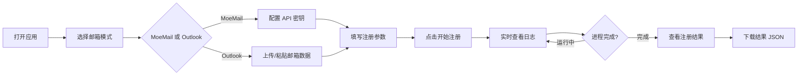

## 1. 产品概述

KiroX Web 是 KiroX CLI 的可视化控制台，用于批量注册 AWS Builder ID 账号。本次改造将现有 Streamlit 界面升级为现代化 React Web 应用，采用类似 one.dxcat.cn 的极简优雅设计风格，提供沉浸式用户体验。

## 2. 核心功能

### 2.1 功能模块
1. **主页/控制面板**: 全局设置、注册参数配置、操作控制
2. **邮箱池管理**: Outlook 邮箱数据上传、粘贴、预览和管理
3. **实时监控**: 进程状态展示、实时日志流、运行控制
4. **结果展示**: 注册结果表格、数据下载、历史记录

### 2.2 页面详情
| 页面名称 | 模块名称 | 功能描述 |
|----------|----------|----------|
| 主页 | Hero 区域 | 品牌标题、状态指示器、快捷操作 |
| 主页 | 全局设置 | 邮箱模式切换、代理配置、并发数设置 |
| 主页 | 参数配置 | 注册数量、任务间隔、调试模式、输出路径 |
| 主页 | 邮箱池管理 | CSV 上传/粘贴、数据预览、账号统计 |
| 主页 | MoeMail 配置 | API 地址和密钥输入（临时邮箱模式） |
| 主页 | 控制面板 | 开始/停止按钮、状态反馈 |
| 主页 | 实时日志 | 日志流展示、运行状态、耗时统计 |
| 主页 | 结果展示 | 数据表格、JSON 下载、结果统计 |

## 3. 核心流程

## 4. 用户界面设计

### 4.1 设计风格
- **色调**: 深色主题为主，深灰/近黑色背景 (#0a0a0a, #111111)，白色文字，搭配温暖的琥珀/金色 (#f59e0b) 作为强调色
- **按钮样式**: 圆角按钮，实心填充主操作按钮，描边辅助按钮，悬停时微妙的发光效果
- **字体**: 使用系统级无衬线字体组合，标题使用更粗的字重，正文保持清晰易读
- **布局**: 单页长滚动布局，模块化卡片分区，左侧边栏设置 + 右侧主内容区
- **动效**: 页面加载时卡片渐入效果，状态切换平滑过渡，按钮点击微交互

### 4.2 页面设计概览
| 页面名称 | 模块名称 | 样式描述 |
|----------|----------|----------|
| 主页 | Hero 区域 | 大标题居中，副标题灰色，顶部状态指示圆点（绿色闪烁=运行中，灰色=空闲） |
| 主页 | 设置卡片 | 半透明背景卡片，左侧标签右侧输入控件，圆角边框 |
| 主页 | 参数网格 | 四列网格布局，每个参数独立卡片区域 |
| 主页 | 邮箱池标签页 | Tab 切换设计，上传区域虚线边框拖拽区 |
| 主页 | 日志区域 | 等宽字体，深色代码块背景，自动滚动到底部 |
| 主页 | 结果表格 | 圆角表格容器，行悬停高亮，分页/滚动 |

### 4.3 响应式设计
- 桌面优先设计，最小宽度 1200px
- 侧边栏在大屏固定左侧，中等屏幕可折叠
- 移动端单列堆叠布局，触摸优化按钮尺寸
