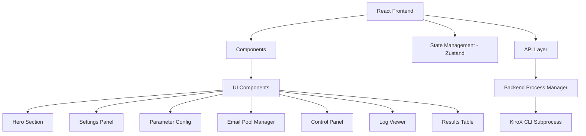

## 1. 架构设计



## 2. 技术说明
- 前端: React@18 + TypeScript + Tailwind CSS + Vite
- 状态管理: Zustand
- 图标: lucide-react
- 后端: 无（保留原有 Python Streamlit 后端逻辑，前端通过 subprocess 调用 CLI）
- 构建工具: Vite

## 3. 路由定义
| 路由 | 用途 |
|------|------|
| / | 主页 - 包含所有功能模块的单页应用 |

## 4. 数据模型

### 4.1 数据类型定义
```typescript
interface OutlookAccount {
  email: string;
  password: string;
  clientId: string;
  refreshToken: string;
}

interface RunParams {
  count: number;
  delay: number;
  concurrency: number;
  debug: boolean;
  output: string;
  proxy: string;
  useOutlook: boolean;
  moemailUrl?: string;
  moemailKey?: string;
  outlookCsv?: string;
}

interface ProcessStatus {
  running: boolean;
  pid: number | null;
  status: 'idle' | 'running' | 'completed' | 'stopped';
  logs: string[];
  elapsed: string;
}

interface RegistrationResult {
  email: string;
  refreshToken: string;
  clientId: string;
  clientSecret: string;
  subscription: string;
  creditUsed: string;
  creditLimit: string;
  region: string;
  provider: string;
}
```
